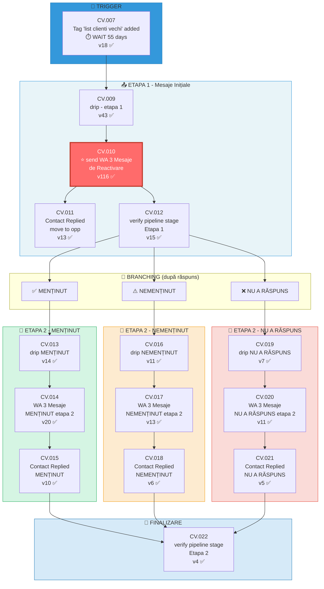
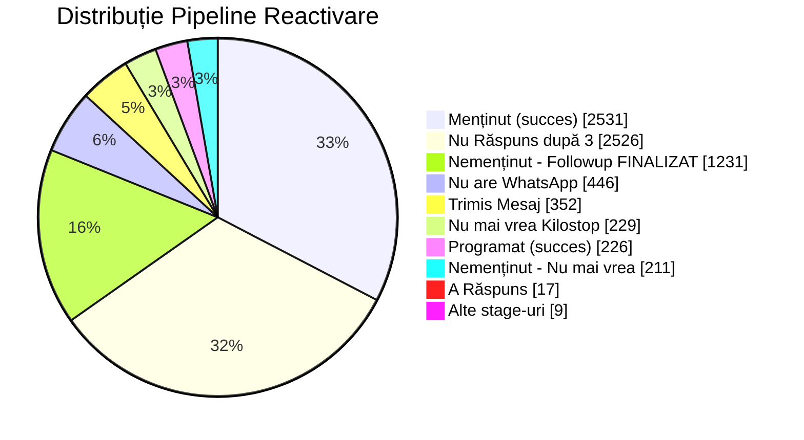

# Raport Investigație: Sistemul CV.* - Reactivare Clienți Vechi

> **Data:** 7 Ianuarie 2026
> **Focus:** CV.010 - send WA 3 Mesaje de Reactivare
> **Metodologie:** Analiză via GHL MCP + Documentație API oficială

---

## Executive Summary

| Metric | Valoare |
|--------|---------|
| **Total Workflows GHL Kilostop** | 387 |
| **Published** | 186 (48%) |
| **Draft** | 201 (52%) |
| **Workflows CV.*** | 34 |
| **CV.* Published** | 22 (65%) |
| **Pipeline Reactivare** | 7,778 oportunități |
| **Workflow Cel Mai Iterat** | CV.010 (v116) |

---

## Limitări API GHL

### Ce am descoperit

Din documentația oficială GHL (`marketplace.gohighlevel.com/docs`), endpoint-urile disponibile pentru workflows sunt:

| Scope | Endpoint | Descriere |
|-------|----------|-----------|
| `workflows.readonly` | `GET /workflows/` | Lista workflows (metadata) |
| `contacts.write` | `POST /contacts/:contactId/workflow/:workflowId` | Adaugă contact în workflow |
| `contacts.write` | `DELETE /contacts/:contactId/workflow/:workflowId` | Scoate contact din workflow |

**NU EXISTĂ** endpoint pentru configurația detaliată a workflow-urilor (triggere, acțiuni, condiții, ramificații).

### Implicații
- Nu putem extrage programatic structura internă a workflow-urilor
- Analiza se bazează pe: nume workflows, relații între ele, versiuni, date

---

## Categorizare Workflows (Top 10 Categorii)

| Prefix | Total | Published | Descriere |
|--------|-------|-----------|-----------|
| **CA** | 65 | 47 | Confirmări Automate |
| **CI** | 39 | 39 | Client Instalat (S0) |
| **P** | 37 | 36 | Prospecți |
| **E** | 35 | 6 | Evenimente/Webinare |
| **CV** | 28 | 22 | Clienți Vechi (Reactivare) |
| **S** | 20 | 17 | Sincronizare (Kilosoft) |
| **Q** | 17 | 6 | Queries/Solicitări |
| **VECHI** | 21 | 0 | Workflows deprecate |
| **CI+CA** | 7 | 7 | Hybrid Client+Confirmare |
| **T** | 12 | 1 | Test |

---

## Top 10 Cele Mai Iterate Workflows

| # | Workflow | Version | Status | Updated |
|---|----------|---------|--------|---------|
| 1 | Q.001 - form submission - active request form | **117** | ✅ | 2025-12-24 |
| 2 | **CV.010 - send WA 3 Mesaje de Reactivare** | **116** | ✅ | 2026-01-02 |
| 3 | CI.003 - send S0 details Unirii: emails + WA | 98 | ✅ | 2025-12-09 |
| 4 | VECHI Q.006 - new appt - update CF | 98 | 📝 | 2025-05-18 |
| 5 | S.015 - new appt - update CF | 68 | ✅ | 2025-11-24 |
| 6 | CA.004 - WA feedback response MEDIC + RECEPȚIE | 67 | 📝 | 2025-12-11 |
| 7 | CA.003 - wait 55 mins after appt - send WA feedback | 66 | 📝 | 2025-12-11 |
| 8 | CI.004 - send S0 details Unirii: emails + WA - Online | 64 | ✅ | 2025-12-10 |
| 9 | CI+CA.005 - Trimite Link Zoom email + WA | 62 | ✅ | 2025-12-16 |
| 10 | P.030 - SECVENȚA 3 - send post 4O personalized emails | 59 | ✅ | 2025-11-11 |

---

## CV.010 - Workflow în Focus

### Metadata

```
ID:         d678a80c-4923-4155-809d-6225f287a8f1
Nume:       CV.010 - send WA 3 Mesaje de Reactivare
Status:     ✅ PUBLISHED
Version:    116 (al 2-lea cel mai iterat din toate!)
Created:    2024-12-18
Updated:    2026-01-02 (modificat acum 5 zile)
Location:   eZ39QIzGACEUO3shhPp7 (Clinica Kilostop)
```

### De ce este important

1. **116 iterații** - arată că este un workflow critic, constant optimizat
2. **Modificat recent** (2026-01-02) - activ folosit și menținut
3. **Parte din sistemul CV.*** - nucleul automatizării de reactivare clienți vechi
4. **Pipeline asociat** - 7,778 oportunități în "Clienti Vechi Reactivare"

---

## Sistemul CV.* - Reactivare Clienți Vechi

### Arhitectura Completă



### Relații Workflow (extrase din nume)

| Sursă | Destinație | Context |
|-------|------------|---------|
| CV.007 | CV.009 | După 55 zile de la tag "list clienti vechi" |
| CV.009 | CV.010 | Drip etapa 1 → trimite mesaje |
| CV.013 | CV.014 | Drip MENȚINUT → mesaje etapa 2 |
| CV.016 | CV.017 | Drip NEMENȚINUT → mesaje etapa 2 |
| CV.019 | CV.020 | Drip NU A RĂSPUNS → mesaje etapa 2 |

---

## Pipeline: Clienti Vechi Reactivare

### Statistici (7,778 oportunități)



### Stage-uri Pipeline

| # | Stage | Descriere | Tip |
|---|-------|-----------|-----|
| 0 | Trimis Mesaj | Mesaj WA trimis, în așteptare | 🔄 În curs |
| 1 | A Răspuns | Contact a răspuns | 🔄 În curs |
| 2 | **Menținut** | Succes - își menține greutatea | ✅ Succes |
| 3 | Nemenținut - Followup IN CURS - nu a răspuns | Follow-up activ | 🔄 În curs |
| 4 | Nemenținut - Followup IN CURS - vrea programare | Vrea programare | 🔄 În curs |
| 5 | Nemenținut - Followup FINALIZAT | Follow-up terminat | ⚪ Finalizat |
| 6 | Nemenținut - Nu mai vrea | Refuză | ❌ Pierdut |
| 7 | **👍 Programat** | Succes - a programat consultație | ✅ Succes |
| 8 | 🛑 Nu mai vrea Kilostop | Refuză total | ❌ Pierdut |
| 9 | Nu Răspuns după 3 | 3 mesaje trimise, fără răspuns | ⚠️ Blocat |
| 10 | Abandonat 30 zile | Inactiv 30+ zile | ⚪ Abandonat |
| 11 | Nemenținut - Followup | În follow-up | 🔄 În curs |
| 12 | Mesaj netrimis - Nu are WhatsApp | Fără WA | ⚠️ Blocat |

### Metrici de Performanță (estimate)

| Metric | Valoare | % din Total |
|--------|---------|-------------|
| **Total oportunități** | 7,778 | 100% |
| **Succes (Menținut + Programat)** | ~2,757 | **35.4%** |
| **Blocați (Nu răspuns + Fără WA)** | ~2,972 | 38.2% |
| **Pierduți (Nu mai vor)** | ~440 | 5.7% |
| **În curs/Finalizat** | ~1,609 | 20.7% |

---

## Workflow CV.010 - Flow Logic (Reconstruit)

```
┌─────────────────────────────────────────────────────────────────────────────┐
│                     CV.010 - send WA 3 Mesaje de Reactivare                 │
│                              (Version 116)                                  │
├─────────────────────────────────────────────────────────────────────────────┤
│                                                                             │
│  TRIGGER: Workflow CV.009 (drip etapa 1) trimite contactul aici            │
│                                                                             │
│  ┌─────────────────────────────────────────────────────────────────────┐   │
│  │ 📤 MESAJ 1 - WhatsApp                                                │   │
│  │ "Bună! Cum te simți? Ai reușit să îți menții greutatea?"            │   │
│  └─────────────────────────────────────────────────────────────────────┘   │
│                              │                                              │
│                              ▼                                              │
│                    ⏱️ WAIT (probabil 2-3 zile)                              │
│                              │                                              │
│             ┌────────────────┴────────────────┐                            │
│             │                                 │                            │
│    [Răspuns primit?]                 [Nu a răspuns]                        │
│             │                                 │                            │
│             ▼                                 ▼                            │
│      → CV.011                                                              │
│      (Contact Replied)   ┌──────────────────────────────────────────┐     │
│                          │ 📤 MESAJ 2 - WhatsApp                     │     │
│                          │ Follow-up / reminder                      │     │
│                          └──────────────────────────────────────────┘     │
│                                           │                                │
│                                           ▼                                │
│                                 ⏱️ WAIT (probabil 2-3 zile)                │
│                                           │                                │
│                          ┌────────────────┴────────────────┐              │
│                          │                                 │              │
│                 [Răspuns primit?]                 [Nu a răspuns]          │
│                          │                                 │              │
│                          ▼                                 ▼              │
│                   → CV.011                                                │
│                                  ┌──────────────────────────────────┐    │
│                                  │ 📤 MESAJ 3 - WhatsApp (final)     │    │
│                                  │ Ultimul reminder                  │    │
│                                  └──────────────────────────────────┘    │
│                                                │                          │
│                                                ▼                          │
│                                      ⏱️ WAIT final                        │
│                                                │                          │
│                               ┌────────────────┴────────────────┐        │
│                               │                                 │        │
│                      [Răspuns primit?]                 [Nu a răspuns]    │
│                               │                                 │        │
│                               ▼                                 ▼        │
│                        → CV.011                           → CV.012       │
│                        (reply)                     (verify stage)        │
│                                                                          │
│  OUTPUT: Contactul este mutat în stage-ul corespunzător din pipeline    │
│  - A Răspuns → evaluare manuală sau automată                            │
│  - Nu a răspuns după 3 → stage "Nu Răspuns după 3"                      │
│                                                                          │
└─────────────────────────────────────────────────────────────────────────────┘
```

---

## Workflows CV.* - Lista Completă

### Trigger & Pregătire
| Workflow | Status | Version | Descriere |
|----------|--------|---------|-----------|
| CV.005 | 📝 | 41 | follow-up pacienti general |
| CV.006 | ✅ | 19 | appointment confirmation in call center calendar |
| CV.007 | ✅ | 18 | tag 'list clienti vechi' → wait 55 days → CV.009 |

### Etapa 1 - Mesaje Inițiale
| Workflow | Status | Version | Descriere |
|----------|--------|---------|-----------|
| CV.009 | ✅ | 43 | drip - etapa 1 → CV.010 |
| **CV.010** | ✅ | **116** | **send WA 3 Mesaje de Reactivare** |
| CV.011 | ✅ | 13 | Contact Replied - move to opp |
| CV.012 | ✅ | 15 | verify pipeline stage form Etapa 1 |

### Etapa 2 - MENȚINUT
| Workflow | Status | Version | Descriere |
|----------|--------|---------|-----------|
| CV.013 | ✅ | 14 | drip - MENȚINUT - etapa 2 → CV.014 |
| CV.014 | ✅ | 20 | WA 3 Mesaje MENȚINUT - etapa 2 |
| CV.015 | ✅ | 10 | Contact Replied MENȚINUT - move to opp |

### Etapa 2 - NEMENȚINUT
| Workflow | Status | Version | Descriere |
|----------|--------|---------|-----------|
| CV.016 | ✅ | 11 | drip - NEMENȚINUT - etapa 2 → CV.017 |
| CV.017 | ✅ | 13 | WA 3 Mesaje NEMENȚINUT - etapa 2 |
| CV.018 | ✅ | 6 | Contact Replied NEMENȚINUT - move to opp |

### Etapa 2 - NU A RĂSPUNS
| Workflow | Status | Version | Descriere |
|----------|--------|---------|-----------|
| CV.019 | ✅ | 7 | drip - NU A RĂSPUNS - etapa 2 → CV.020 |
| CV.020 | ✅ | 11 | WA 3 Mesaje NU A RĂSPUNS - etapa 2 |
| CV.021 | ✅ | 5 | Contact Replied NU A RĂSPUNS - move to opp |

### Finalizare
| Workflow | Status | Version | Descriere |
|----------|--------|---------|-----------|
| CV.022 | ✅ | 4 | verify pipeline stage form Etapa 2 |

### Consultații Anuale (Post-Reactivare)
| Workflow | Status | Version | Descriere |
|----------|--------|---------|-----------|
| CV.023 | ✅ | 3 | verify location → send Consultatie Anuala details |
| CV.024 | ✅ | 8 | Consultatie Anuala email - Unirii, In Clinica |
| CV.025 | ✅ | 5 | Consultatie Anuala email - Unirii, Online |
| CV.026 | ✅ | 4 | Consultatie Anuala email - Victoriei, In Clinica |
| CV.027 | ✅ | 4 | Consultatie Anuala email - Victoriei, Online |

---

## Concluzii

### Ce face CV.010
1. **Primește contacte** de la CV.009 (drip etapa 1)
2. **Trimite 3 mesaje WhatsApp** secvențial cu intervale de așteptare
3. **Monitorizează răspunsurile** - dacă răspunde, trimite la CV.011
4. **După 3 mesaje fără răspuns** - trimite la CV.012 pentru evaluare

### De ce are 116 versiuni
- Mesajele WhatsApp au fost optimizate constant
- Timing-ul între mesaje a fost ajustat
- Condiții și ramificații au fost rafinate
- Integrare cu pipeline-ul de reactivare

### Eficiența sistemului
- **35.4% rată de succes** (Menținut + Programat)
- **38.2% blocați** - potențial de optimizare prin:
  - Canale alternative pentru cei fără WhatsApp
  - Mesaje mai persuasive
  - Timing diferit

---

## Recomandări

1. **Optimizare mesaje** - Analizează conținutul celor 3 mesaje pentru conversii mai bune
2. **Canal alternativ** - Pentru 446 contacte fără WhatsApp, consideră SMS sau email
3. **A/B Testing** - Testează variante de mesaje în TMP CV.010
4. **Reducere timpi** - 55 zile delay inițial poate fi prea lung
5. **Re-engagement** - Pentru cei 2,526 "Nu Răspuns după 3", consideră o etapă 3 după X luni

---

*Raport generat automat prin GHL MCP Server*
*Data: 7 Ianuarie 2026*
